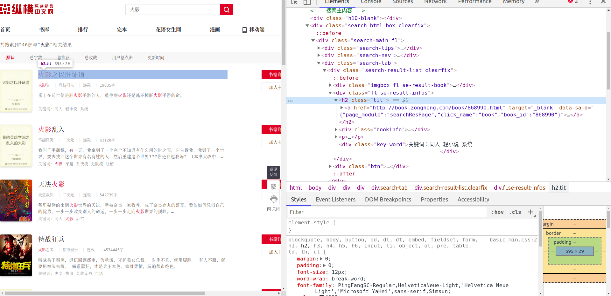

# Golang爬虫简明教程

爬虫大体上分为两种类型，一种是爬取网页源码，另一种就是模拟请求API获取数据。这里我们只讨论第一种形式。

# 分析网页

以[纵横中文网]([http://zongheng.com](http://zongheng.com/))为例，我们的目的是输入一个搜索的关键字，获取返回的数据。我们输入“火影”（因为这个数据比较多），发现会跳转到[这个页面]([http://search.zongheng.com/s?keyword=%E7%81%AB%E5%BD%B1](http://search.zongheng.com/s?keyword=火影))，然后再点击下一页，发现链接变成了`http://search.zongheng.com/s?keyword=火影&pageNo=2&sort=`，多了 `pageNo` 和 `sort` 这两个请求字段，很明显，它们分别是页码和排序方式。

这条链接就是我们要爬的目标链接了，或者说是目标网页。

要爬取网页，首先要学会分析页面的元素。

按下 F12（Fn+F12），进入开发者模式，在第一栏的元素（Elements）中，可以看到一堆 HTML 代码，鼠标移动到代码上发现页面有部分会高亮，那么这就是高亮的那部分页面内容的代码。挨个尝试，找到小说的标题，该 HTML 标签就是我们要爬取的东西。



# 代码实现

分析完网页，知道了该爬什么标签后，就可以动手写代码了。

## 获取网页源码

首先要模拟浏览器发送网络请求，用到`"net/http"`库。

http 是Go语言提供的标准库之一，可以发起和接受 http 网络请求。

>   net/http [官方文档](https://golang.org/pkg/net/http/)

```go
requestUrl := "http://search.zongheng.com/s?keyword=火影&pageNo=1&sort="
rp, err := http.Get(requestUrl)
if err != nil {
	panic(err)
}
```

然后用`"io/ioutil"`解析成我们能够阅读的源码。

>   io/ioutil [官方文档](https://golang.org/pkg/io/ioutil/)

```go
body, err := ioutil.ReadAll(rp.Body)
if err != nil {
	panic(err)
}
content := string(body)
defer rp.Body.Close()
```

可以尝试着输出着看一下内容：

```go
fmt.Println(content)
```

## 爬文档树

然后要从这个网页代码中找到我们所需要的东西，这里用到了 [`goquery`库](https://github.com/PuerkitoBio/goquery)，`goquery`将 HTML 文档解析成一个 DOM树，可以较为方便地获取 HTML 标签中的内容。具体怎么使用就需要自己去看文档了，这是一个主动学习和探(zhe)索(teng)的过程。

>   goquery [使用文档](https://godoc.org/github.com/PuerkitoBio/goquery)

导入包：

```go
import (
    // ...
    "github.com/PuerkitoBio/goquery"
)
```

代码：

```go
dom, err := goquery.NewDocumentFromReader(strings.NewReader(content))
if err != nil {
	panic(err)
}
dom.Find(".search-tab").Each(func(i int, selection *goquery.Selection){
	selection.Find(".tit").Each(func(i int, title *goquery.Selection) {
		fmt.Printf("%3d   ", num)
		fmt.Println(title.Text())
		num++
	})
})
```

相信你在获取标签内容的过程中，肯定会遇到很多困难，出现的许多情况都非如人意的，这十分正常，多多尝试，多多 `Println`，相信你会取得你想要的东西。

## 优化

按照上述的代码基本上是可以爬取到一个页面内的数据的，但我们并不满足于此，我们要求获得更多的搜索数据。注意链接了吗？我们可以通过改变页码来获得多个页面的查询数据。

```go
keyword := "火影"

for i := 1; i <= 10; i++ {
	requestUrl := "http://search.zongheng.com/s?keyword=" + keyword + "&pageNo=" + strconv.Itoa(i) + "&sort="
    // ...
}
```

搜索字段可以加一个`Scanf`来输入

```go
var keyword string
fmt.Scanln(&keyword)
```

这样基本上就差不多了。

>   [完整代码](https://github.com/Shadowmaple/go/blob/master/muxi101/crawler/crawler.go)

当然还有更多功能留待你去优化，在此举了两个例子：

+   获取总页码（totalPage）来获取全部的搜索数据
+   将爬取到的数据写入到一个文件中，而非输出到终端界面
+   过滤标题不是搜索关键字的数据


另外建议，有问题多上Google，很多问题都可以得到解决。若是觉得这篇文档太简略，也可以去看下别家的文档。