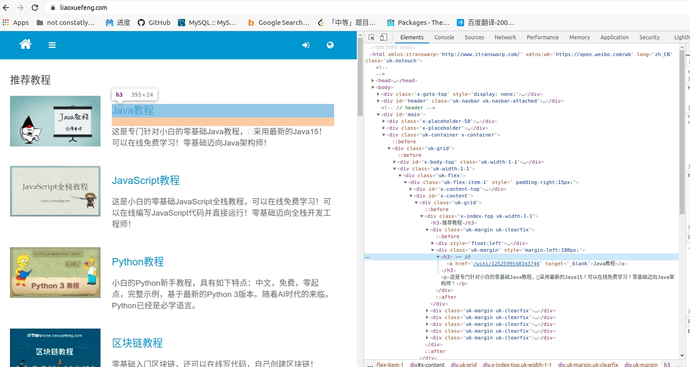

# Golang爬虫简明教程

爬虫大体上分为两种类型，一种是爬取网页源码(一般是HTML)，另一种就是模拟请求API获取数据。这里我们只讨论第一种形式。

假设你们了解HTTP相关知识(看完一半的图解HTTP)

# 爬取HTML源码

以[廖雪峰的官网]([https://www.liaoxuefeng.com/)为例(因为它网页内容基本不会变)

> https://www.liaoxuefeng.com/

这条链接就是我们要爬的目标链接了，或者说是目标网页。

首先我们可以先尝试直接爬取网页HTML源码

我们爬虫就是要模拟浏览器网络请求,用到"net/http"库

> http 是Go语言提供的标准库之一，可以发起和接受 http 网络请求
>
> net/http[官方文档](https://golang.org/pkg/net/http/) 
>
> 要学会看官方文档，学会怎么调用标准库的函数

## 代码实现

```go
requestUrl := "https://www.liaoxuefeng.com/"   
// 发送Get请求
rsp, err := http.Get(requestUrl)    
if err != nil {
    log.Println(err.Error())
    return
}
```

然后用`"io/ioutil"`解析成我们能够阅读的源码。

>   io/ioutil [官方文档](https://golang.org/pkg/io/ioutil/)

```go
body, err := ioutil.ReadAll(rsp.Body)
if err != nil {
    log.Println(err.Error())
    return
}
content := string(body)
defer rsp.Body.Close()
```

可以尝试着输出着看一下内容：

```go
fmt.Println(content)
```


## 解析HTML

***上面爬取的是HTML的源码，标签和内容混杂在一起，很杂乱。 接下来我们就要分析HTML网页，找到我们想要获取的信息是在哪个标签中***

按下 F12（Fn+F12），进入开发者模式（下面是Chrome的界面），在第一栏的元素（Elements）中，可以看到一堆 HTML 代码，鼠标移动到代码上发现页面有部分会高亮，那么这就是高亮的那部分页面内容的代码。挨个尝试，找到标题，该 HTML 标签就是我们要爬取的东西。




然后要从这个网页代码中提取我们所需要的东西，这里用到了 [`soup`库](https://github.com/anaskhan96/soup)，`soup库`将 HTML 文档解析成一个 DOM树，可以较为方便地获取 HTML 标签中的内容。具体怎么使用就需要自己去看文档了，这是一个主动学习和探(zhe)索(teng)的过程。

>   soup库比较简单，没有很成熟的文档，自己可以去看它github下面的函数使用介绍以及Examples，学会怎么调用它的函数
>
>   它的Examples很重要很重要很重要，我也是看Example写的，，

下面我要爬取所有文章的标题

导入包：

```go
import (
    // ...
   "github.com/anaskhan96/soup"
)
```

代码：

```go
    requestUrl := "https://www.liaoxuefeng.com/"   
    // 发送Get请求
    rsp, err := http.Get(requestUrl)    
    if err != nil {
        log.Println(err.Error())
        return
    }
	body, err := ioutil.ReadAll(rsp.Body)
    if err != nil {
        log.Println(err.Error())
        return
    }
    content := string(body)
    defer rsp.Body.Close()
	
// 下面主要是解析标签
    doc:=soup.HTMLParse(content)
    subDocs:=doc.FindAll("div","class","uk-margin")
    for _,subDoc:=range subDocs{
        link:=subDoc.Find("a")
        fmt.Println(link.Text())
    }
```

> 相信你在获取标签内容的过程中，肯定会遇到很多困难，出现的许多情况都非如人意的，这十分正常，多多尝试，相信你会取得你想要的东西。遇到问题要多尝试，多试几种方法，多用```Println```找错误
>
> 上面代码解析出来的标题其实是有一些问题的，有一些意料之外的空行（标题的标签匹配的范围太广导致）
>
> 我也是当天接触这个包，当天给你们写教程，对这个包研究不深入，通过解析标签，阅读文档和里面的Examples, 你可以自己琢磨出一些匹(sao)配(cao)方(zuo)法，来改进我的代码，去掉那些多余的空行
>
> 相信这是你们第一次看github上开源库的文档并学习如何使用它们，好好锻炼好好折腾吧
>
> 这个包连自己文档都写的不咋地，也别指望找中文教程了。 [doge]


### 进阶

  当你在第一步爬取到源码之后，如果觉得有些信息无法通过解析标签获取，那个soup包用的也不是那么随心所欲， 有空的话可以看看正则表达式，用官方的[regexp库](https://golang.org/pkg/regexp/)，来自己手动写匹配模式，匹配到你想要的信息。 

要用的话建议还是看标准库。实在看不懂就去中文社区找几个例子照着写。