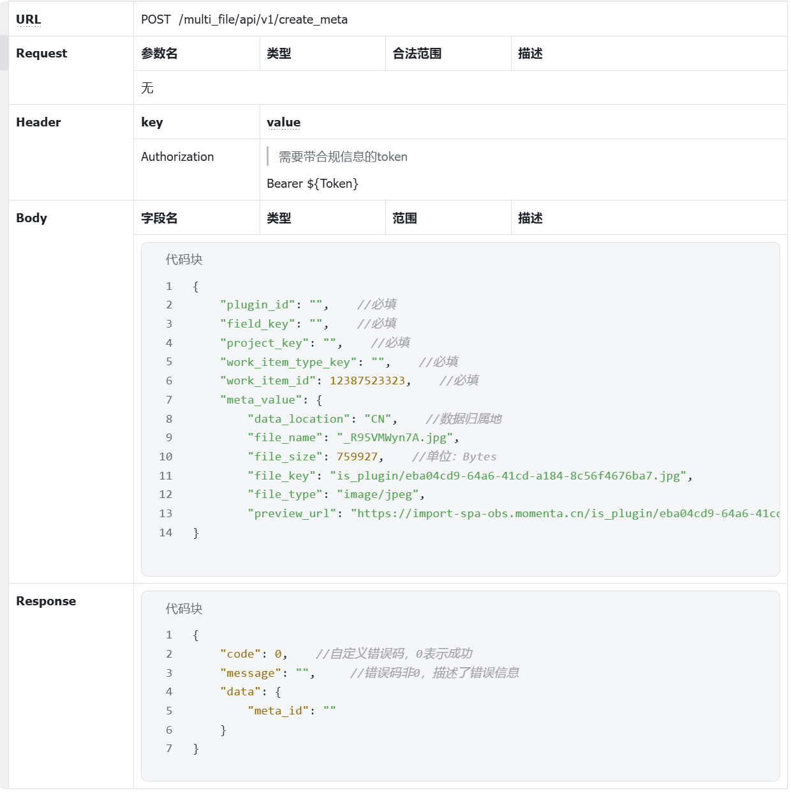

# 大一上学期

> 本学期主要内容是：学习 Go 语言基础；学习网络基础，数据库基础和 SQL 语言；学习使用 Gin 和 Gorm 开发 Web 应用。

## Before-Learning

- [交大生存手册](https://survivesjtu.gitbook.io/survivesjtumanual)
- [提问的智慧](https://github.com/ryanhanwu/How-To-Ask-Questions-The-Smart-Way/blob/main/README-zh_CN.md)
- [AI时代下如何自学](https://sspai.com/post/97972)
- 安装[golang](https://golang.google.cn/)并学习基础语法


## week1 计算机学习基础

### 科学上网

- 科学上网是每个计算机人必备的工具。外面好的资源比较多，上个 github 也轻松多了。

### AI工具

- 学习[ChatGPT](https://chatgpt.com/)，[Claude](https://claude.ai/)，[DeepSeek](https://chat.deepseek.com/) 等大语言模型的基本使用和技巧

### 版本控制

#### 注册github账号

- 网址：https://github.com
- 全英文的网站，不会的上网查一下怎么注册

#### 学习版本控制（git命令）

| 了解概念 | [Git - Git 简史](https://git-scm.com/book/zh/v2/起步-Git-简史) |
| -------- | ------------------------------------------------------------ |
| 快速入门 | [【GeekHour】一小时Git教程_哔哩哔哩_bilibili](https://www.bilibili.com/video/BV1HM411377j/?vd_source=759f1069246293fdd4f23942f4b0d991) |
| 常用命令 | [常用 Git 命令清单 - 阮一峰的网络日志](https://www.ruanyifeng.com/blog/2015/12/git-cheat-sheet.html) |
| 多加练习 | [Learn Git Branching](https://learngitbranching.js.org/?locale=zh_CN) |

### Markdown（[飞书](https://www.feishu.cn/)+本地）

1. Markdown 是非常好用的轻量级标记语言，我们经常用它写文档/笔记。所谓标记语言，就是**将文本以及文本相关的其他信息结合起来，展现出关于文档结构和数据处理细节的计算机文字编码。**别的文本标记语言还有 HTML 等。
2. 可以用Typora或者[obsidian](https://obsidian.md/)：
3. 重点学习：代码块、多级标题、数字标题、圆点标题、加粗、删除线......

### Linux环境

 安装WSL（Windows系统必做、Mac系统忽略）

| 入门介绍 | [linux入门介绍(通俗易懂，快速理解linux)_linux和ubuntu有什么关系-CSDN博客](https://blog.csdn.net/weixin_45533131/article/details/142434993) |
| -------- | ------------------------------------------------------------ |
| 安装     | [安装 WSL](https://learn.microsoft.com/zh-cn/windows/wsl/install) OR [win11如何安装wsl](https://blog.csdn.net/weixin_44589672/article/details/130806222)[解决"wsl: 检测到 localhost 代理配置，但未镜像到 WSL。NAT 模式下的 WSL 不支持 localhost 代理"](https://www.cnblogs.com/hg479/p/17869109.html) |
| 基础命令 | [常用 Git 命令清单 - 阮一峰的网络日志](https://www.ruanyifeng.com/blog/2015/12/git-cheat-sheet.html) |
| vim      | https://juejin.cn/post/6844903983727771661                   |

### 拓展学习

- [《程序是如何跑起来的》](https://item.jd.com/13343601.html)第一到三章

- 计算机教育缺失的部分：[the missing semester](https://www.bilibili.com/video/BV1x7411H7wa)

### 主线任务：

1. 科学上网并注册GPT
2. 完成安装WSL
3. 在**WSL的本地仓库**中用vim编写解答[两数之和 - 力扣（LeetCode）](https://leetcode.cn/problems/two-sum/)并使用Markdown编写题解
4. 推送至github


## week2  Docker,云服务器和go语言基础

### 云服务器申请

申请一台自己的服务器，学会使用ssh连接远程服务器，推荐工具：[termius](https://termius.com/download/windows)

### Docker学习

> docker是一个容器化平台，简单的来说就是可以把一堆乱七八糟的软件与你的电脑环境隔离开来，你在本地能够运行，在服务器上也能运行。

1. Docker安装（由于国内镜像大多无法使用可以去这里找镜像源：https://github.com/dongyubin/DockerHub）

    | 本地安装   | https://www.docker.com/                                      |
    | ---------- | ------------------------------------------------------------ |
    | 服务器安装 | [docker菜鸟教程](https://www.runoob.com/docker/ubuntu-docker-install.html) |

2. Docker学习（dokcer基本命令以及docker-compose的简单使用）
   
     | 快速入门 | [阮一峰docker超快速入门](https://ruanyifeng.com/blog/2018/02/docker-tutorial.html) |
     | -------- | ------------------------------------------------------------ |
     | 深度学习 | [docker菜鸟教程](https://www.runoob.com/docker/docker-tutorial.html)，[docker从入门到实践](https://docker-practice.github.io/zh-cn/) |

3. 基于docker搭建自己的博客

    | 推荐教程 | [使用docker部署基于wordPress的博客](https://www.cnblogs.com/pzy-Albert/p/18391693) |
    | -------- | ------------------------------------------------------------ |
    | 涉及知识 | mysql，ip，端口（不用深入学，问问gpt就行）                   |

### go语言基础

####  编辑器

- vscode：[Visual Studio Code - Code Editing. Redefined](https://code.visualstudio.com/)
- goland官网（可以申请学生版）：https://www.jetbrains.com/go/

####  教材

> go圣经的内容非常丰富权威，但是很多表达和示例对入门不太友好，所以从中选取了一些较为合适的内容作为Task。

- [《The way to Go》](https://www.kancloud.cn/kancloud/the-way-to-go/72432)（主要）
- [《The Go Programming Language》](https://www.kancloud.cn/hartnett/gopl-zh/126045)
- [《go语言中文文档》](https://www.topgoer.com/)

####  学习内容

1. 了解 Go 语言的历史

   - 阅读《The Go Programming Language》的**前言**；

   - 《The way to go》**第一章**；

   - 谷歌搜索了解一下 Go 语言的**主要作者**；

2. 学习 Golang 的基本语法

   - 《The way to go》**4 - 10.6 章**；

   - 《The Go Programming Language》的 **2 - 6 章**。

#### 主要知识点

基础语法

- 基本数据类型
- 变量声明（特别注意 Short Variable Declarations）
- 指针类型（《The Go Programming Language》2.3.2）
- 函数声明和调用（详细的在《The Go Programming Language》第五章
- 包（Package）

数据结构

- 数组与切片
- 字符串
- Map
- 切片、数组、字符串的内部实现和联系

类型系统

- 结构体
- 结构体方法（Value receiver VS Pointer receiver）
- 类型组合
- ~~接口（interface）与实现~~

###  Task

- 利用闭包实现一个计数器
- map和slice内存扩容的区别
- 比较字符串"hello，世界"的**长度** 和for range 该字符串的循环**次数**
- 如何进行结构体之间的比较？
- 以下哪里x进行重新声明，为什么

```Go
  func main() {
      x := "hello!"
      for i := 0; i < len(x); i++ {
          x := x[i]
          if x != '!' {
              x := x + 'A' - 'a'
              fmt.Printf("%c", x) // "HELLO" (one letter per iteration)
         }
     }
  }
```

###  扩展阅读

- 《程序是如何跑起来的》第四到七章
- [静态语言和动态语言的区别](https://juejin.im/entry/5c7373426fb9a049bd42eff4)
- [值传递 VS 引用传递](https://goinbigdata.com/golang-pass-by-pointer-vs-pass-by-value/)
- [Golang 需要避免踩的 50 个坑](https://juejin.im/post/6844903816018542600)
- [Go 标准库](https://golang.org/pkg/)，英文阅读困难的也可选择[中文版](https://studygolang.com/static/pkgdoc/main.html)

### 主线任务：

1. 学习docker基础使用，并使用docker搭建一个博客
2. 上传在学习golang基础语法的时候所编写的代码到github仓库上，docker学习笔记传到博客。


## week3  Go模块管理,并发编程

### Go模块管理：

- goRoot ，GoPath，GoProxy
- go.mod，go.work 基本概念和命令

#### 教材：

| 快速入门 | [Go中文学习文档](https://golang.halfiisland.com/essential/senior/115.module.html#准备) |
| -------- | ------------------------------------------------------------ |

#### Task：

1. 编写涉及两个go.mod的项目并允许其A模块调用B模块分别使用go.work和replace实现
2. 编写一个简单的util库上传到github上，实现两数相加并使用 go get 从github上拉取

### 并发编程:

#### 教材:

（这个是重头、goroutine、channel、sync等）,可能比较难，也可以自己找点资料。

理解什么是并发和并行,串行?

学习如何在go语言中使用并发？

| 快速入门 | [Go中文学习文档并发](https://golang.halfiisland.com/essential/senior/110.concurrency.html#有缓冲) |
| -------- | ------------------------------------------------------------ |
| 深入学习 | [Go语言中文文档](https://www.topgoer.com/并发编程/)          |
| Go圣经！ | [Go语言圣经第八章](https://golang-china.github.io/gopl-zh/ch8/ch8.html) |

#### Task:

1. 思考以下程序在**并发中**出现panic的可能是什么？并给出解决方案

```Go
package main

type message struct {
    Topic     string
    Partition int32
    Offset    int64
}

type FeedEventDM struct {
    Type    string
    UserID  int
    Title   string
    Content string
}

type MSG struct {
    ms        message
    feedEvent FeedEventDM
}

const ConsumeNum = 5

func main() {
    var consumeMSG []MSG
    var lastConsumeTime time.Time // 记录上次消费的时间
    msgs := make(chan MSG)

    //这里源源不断的生产信息
    go func() {
       for i := 0; ; i++ {
          msgs <- MSG{
             ms: message{
                Topic:     "消费主题",
                Partition: 0,
                Offset:    0,
             },
             feedEvent: FeedEventDM{
                Type:    "grade",
                UserID:  i,
                Title:   "成绩提醒",
                Content: "您的成绩是xxx",
             },
          }
          //每次发送信息会停止0.01秒以模拟真实的场景
          time.Sleep(100 * time.Millisecond)
       }
    }()

    //不断接受消息进行消费
    for msg := range msgs {
       // 添加新的值到events中
       consumeMSG = append(consumeMSG, msg)
       // 如果数量达到额定值就批量消费
       if len(consumeMSG) >= ConsumeNum {
          //进行异步消费
          go func() {
             m := consumeMSG[:ConsumeNum]
             fn(m)
          }()
          // 更新上次消费时间
          lastConsumeTime = time.Now()
          // 清除插入的数据
          consumeMSG = consumeMSG[ConsumeNum:]
       } else if !lastConsumeTime.IsZero() && time.Since(lastConsumeTime) > 5*time.Minute {
          // 如果距离上次消费已经超过5分钟且有未处理的消息
          if len(consumeMSG) > 0 {
             //进行异步消费 
             go func() {
                m := consumeMSG[:ConsumeNum]
                fn(m)
             }()
             // 更新上次消费时间
             lastConsumeTime = time.Now()
             // 清空插入的数据
             consumeMSG = consumeMSG[ConsumeNum:]
          }
       }
    }
}

func fn(m []MSG) {
    fmt.Printf("本次消费了%d条消息\n", len(m))
}
```

1. 使用for循环生成20个goroutine，并向一个channel传入随机数和goroutine编号，等待这些goroutine都生成完后，想办法给这些goroutine按照编号进行排序(输出排序前和排序后的结果,要求不使用额外的空间存储着20个数据)
2. 经典老题：交叉打印下面两个字符串（要求一个打印完，另一个会继续打印） "ABCDEFGHIJKLMNOPQRSTUVWXYZ" "0123..." 得到："AB01CD23EF34..."

### 拓展阅读:

- 《程序是如何跑起来的》第八到九章。
- [《图解http》](https://item.jd.com/10113289276755.html)第一到二章，提前学习一点http基础知识，下周要用。

### 主线任务：

1. 完成作业并上传作业到github仓库上

## week4 网络基础 json，http，鉴权

### 网络基础：

#### http基础：

目标：

1. 了解web请求的基本流程（客户端，服务端）
2. 了解TCP/IP协议，http协议
3. 相关概念：url，ip，请求头,响应头，负载，状态码等

推荐阅读：

1. 《图解http》第3-6章

#### go的net/http

如何构建http请求

| 快速入门 | [Golang net/http标准库常用请求方法](https://segmentfault.com/a/1190000044879178) |
| -------- | ------------------------------------------------------------ |
| 深入学习 | [Golang net/http标准库](https://studygolang.com/pkgdoc)      |

#### JSON：go结构体值对应的JSON的编写

| 基本概念   | [菜鸟教程(json)](https://www.runoob.com/json/json-tutorial.html) |
| ---------- | ------------------------------------------------------------ |
| json in Go | [JSON - Go圣经](https://golang-china.github.io/gopl-zh/ch4/ch4-05.html) |

#### 鉴权：

> 鉴权就是确认某个人或设备是否是他们声称的身份。例如，登录时你输入用户名和密码，系统会验证这对凭证是否匹配，以确认你是合法用户。

Cookie、Session、Token、JWT的作用和区别。

| 参考资料 | [还分不清 Cookie、Session、Token、JWT？看这一篇就够了](https://developer.aliyun.com/article/1358589) |
| -------- | ------------------------------------------------------------ |
| 其他     | 自己找点康康                                                 |

## week5 简单web服务

### 学习内容

1. 推荐阅读: [Go Web 基础](https://learnku.com/docs/build-web-application-with-golang/3-web-basis/3167)
2. 理解一个简单的web服务: [Web服务 - Go圣经](https://golang-china.github.io/gopl-zh/ch1/ch1-07.html)

### 拓展阅读

《图解http》第3-6章

### Task

利用学习内容完成一个简单的用户管理系统:

#### 要求：

##### 必做:

1. 具有注册、登录、修改密码、获取和修改用户信息等功能
2. 登陆功能需要存储用户状态，用 cookie/session/token 之一实现即可
3. 定义一个结构体存储用户，用户具有用户名、昵称等基本信息
4. 不需要数据持久化，使用全局变量存储即可，也可以试试存文件里
5. 只需要写后端API，不需要写前端页面
6. 使用 postman 测试

##### 选做:

1. 试试部署到你的服务器上（docker或者编译完直接执行二进制文件都行）,暴露端口为8080(如果有时间的话可以试试)

## week6 爬虫模拟请求

### 网页前端

| 基本概念 | [html](https://www.w3school.com.cn/html/html_jianjie.asp) , [js](https://www.runoob.com/js/js-tutorial.html) , [css](https://www.runoob.com/css/css-tutorial.html) (了解是啥就行) |
| -------- | ------------------------------------------------------------ |
| 页面检查 | [小白也能懂的F12](https://blog.csdn.net/weixin_49171365/article/details/132092146)(重点在于网络部分) |

### Web爬虫

| 爬虫     | [爬虫简明教程（超链接）](../crawler/go_crawler.md)           |
| -------- | ------------------------------------------------------------ |
| 正则匹配 | [正则匹配(简单了解下原理即可)](https://www.runoob.com/regexp/regexp-tutorial.html) |
| 模拟登录 | [模拟登陆简明教程（超链接）](../crawler/simulate_login.md)   |

### TASK:

#### task 1

爬取微博指定用户的帖子

要求:

- 帖子时间范围大于等于一周
- post_id，cookie等可以直接从浏览器中复制不需要模拟登录

#### task2

模拟登陆[豆瓣](https://www.douban.com/)网

## week7 数据库基础

### MYSQL：

#### 学习目标:

1. 了解数据库的基本概念，了解关系型数据库和非关系型数据库的区别
2. 安装 MySQL (直接装物理机和docker都可以试试)
3. 学习数据库三范式+BCNF范式
4. 学习 SQL 基本语法和mysql基本使用（终端和可视化都要会）
   1. SQL 支持的数据类型（以 MySQL 版为主）
   2. 数据定义语言 DDL：
      - 数据库的创建、删除； 
      - 对表的创建、删除和修改；
   3. 数据操纵语言 DML：
      - 表数据的增删改
      - 数据的查询（排序、过滤、数量限制等）
      - 表连接

#### 参考资料:

| mysql安装      | [mysql安装教程](https://www.runoob.com/mysql/mysql-install.html) |
| -------------- | ------------------------------------------------------------ |
| 可视化工具     | 随便选一个喜欢的，想选别的也行：[dbeaver](https://dbeaver.io/) （首推！真好用），[workBench](https://www.mysql.com/products/workbench/) ，[nacivate](https://www.navicat.com.cn/sponsorship/education) |
| sql基础语法    | [菜鸟教程sql](https://www.runoob.com/sql/sql-tutorial.html)，[菜鸟教程mysql](https://www.runoob.com/mysql/mysql-tutorial.html)，其实随便看点啥都行蛮简单的 |
| database/sql库 | [database/sql](https://pkg.go.dev/database/sql)              |

#### 任务

1. 用`database/sql`完成第五周用户管理系统任务的数据持久化

要求：

- 连接你的服务器上的mysql（之前搭建博客的时候应该用docker装过，没装过的话装一下）

- 不要使用包装的太严实以至于用不到sql语句的orm(比如gorm,xorm等)

### ER图与UML图

#### 学习目标:

1. 了解什么是ER图和UML图
2. 会画ER图和常用的UML图(类图,时序图,数据流图之类的)
3. 理解UML图与mysql表的对应关系

| UML图    | [概念](https://www.visual-paradigm.com/cn/guide/)，[示例图](https://circle.visual-paradigm.com/diagram-examples/) |
| -------- | ------------------------------------------------------------ |
| ER图     | [ER图教程](https://static.kancloud.cn/apachecn/beginnersbook-zh/1955401) |
| 画图工具 | [whimsical](https://whimsical.com/,) ，[boardmix](https://boardmix.cn/) |

#### 任务：

1. 使用ER图和UML类图完成学校图书馆系统的设计（没去过的可以去实地考察一下）

注意：

- 学校的图书馆主要是借阅书籍和自习两个功能，可以尽可能的完善。（先完成借阅书籍）
- 设计 ER 图的时候只需要画实体和关系，不需要属性；
- 设计 UML 类图时需要仔细考虑产品需求和实际情况，设计的字段（属性）应不多也不少。

## week8 综合项目(图书管理系统)

运用前几周所学知识，完成一个图书管理系统的完整后端

### 前后端对接:

#### 参考资料：

| RESTful API | [菜鸟教程](https://www.runoob.com/w3cnote/restful-architecture.html) |
| ----------- | ------------------------------------------------------------ |
| api文档     | [api文档简单介绍](https://apifox.com/apiskills/what-is-api-docs-and-how-to-write-api-docs/) |
| swagger     | [swagger学习](https://cloud.tencent.com/developer/article/2334489) |
| apifox      | [apifox下载](https://apifox.com/)                            |

#### 学习目标：

- 了解什么是RESTful API，什么是api文档。
- 使用swagger生成api文档(goRoot 和goPath有问题的回去处理一下,可能会出问题)
- 使用apifox进行调试,学会如何导入swagger文档和如何使用apifox发请求。

### 前后端部署：

#### 参考资料：

| go交叉编译 | [手把手教你go语言跨平台编译](https://blog.csdn.net/qq_41672878/article/details/119410602)，[go语言中文文档](https://www.topgoer.com/其他/跨平台交叉编译.html) |
| ---------- | ------------------------------------------------------------ |
| nginx      | [nginx官网](https://nginx.org/en/)                           |

#### 学习目标：

- 学会go交叉编译（在windows或者mac上编译成linux上可执行的二进制文件）
- 学会使用nginx反向代理实现前端部署。（拓展学习，可选）

### Task

运用这几周所学实现一个图书管理系统的完整后端。

#### 基本需求：

1. 对图书的增删改查
2. 读者和管理员的权限区分

#### 任务要求：

1. 使用AI编写前端
2. 编写接口文档
3. 将后端代码部署到服务器上（前端代码不要求部署，当然部署最好）
4. 后端使用交叉编译出的二进制文件部署，因为会经常性更新

### Tips：

1. 前后端对接的时候可能会遇到跨域问题需要解决
2. 部署的时候对应端口的防火墙和安全组记得关闭

接口文档格式参考：




## week9 Gin,Gorm与MVC

### MVC

学习要求：

- 了解MVC的概念和每一层的意义
- 熟悉go中MVC的基本实现

### Gin

学习要求：

- 熟悉[Gin](https://gin-gonic.com/zh-cn/)语法，学会使用gin进行路由的注册和端口的监听
- 了解gin与原生net/http的区别

### Gorm

学习要求：

- 了解什么是ORM
- 学会使用[Gorm](https://gorm.io/zh_CN/docs/index.html)操作数据库

### Task

1. 将week8任务使用mvc架构重写


## week10 流式响应与GRPC

### SSE与Websocket

学习要求:

1. 了解网络协议的发展过程(TCP/IP,UDP,HTTP,HTTPS,RPC等)
2. 了解SSE和Websocket的实现原理
3. 学习SSE和Websocket的使用场景和基本实现

### GRPC

1. 学会编写proto文件
2. 安装并学会使用protoc生成go语言和python代码(python建议安装3.9版本,比较稳定)
3. 学会使用生成的代码进行grpc通信

### 拓展学习:

1. 了解[Socket编程](https://www.topgoer.com/网络编程/socket编程/)基本概念
2. 学习[go-streams](https://github.com/reugn/go-streams)等流式处理工具库

参考资料:

| go-SSE    | [使用go实现一个sse](https://juejin.cn/post/7436724644897390602) |
| --------- | ------------------------------------------------------------ |
| webSocket | [万字长文解说Websocket](https://cloud.tencent.com/developer/article/1887095) |
| gRPC      | [Go gRPC](https://blog.csdn.net/qq_37102984/article/details/143026783),[Py gRPC](https://zhuanlan.zhihu.com/p/363810793) |

### 任务要求:

1. 使用SSE完成一个llm流式响应后端程序
   - 使用Langchain(python)作为llm服务后端
   - go程序使用grpc的stream进行跨服务流式通信
   - 使用sse技术推送给前端

2. 使用Websocket完成一个聊天室
   - 要求聊天室能够实时显示在线人数
   - 能够进行群聊
   - 当人数到达上限时将禁止新人进入(对ip进行限流)

## week10 面向接口编程与依赖注入

### 面向接口编程

1. 面向对象编程基础：
   - 了解什么是面向对象编程
   - 深入了解什么是耦合与解耦合
   - [go语言如何构造类](http://books.studygolang.com/gopl-zh/ch6/ch6-01.html)
   - 类的继承与组合
   - [dao模式](https://www.runoob.com/design-pattern/data-access-object-pattern.html)（操作类与模型）

2. 面向接口编程基本思想
   - [接口](http://books.studygolang.com/gopl-zh/ch7/ch7.html)的概念与基本使用
   - 面相接口与面向对象的区别定义与实现接口

### 依赖注入

1. 控制反转（IOC）与依赖注入基本概念
2. 单例模式在依赖注入中的体现
3. 依赖注入工具[wire](https://github.com/google/wire?tab=readme-ov-file)

### 拓展学习：

1. [设计模式](https://refactoringguru.cn/design-patterns/catalog)

### 任务：

1. 改造week9中重构的项目使其符合面向接口编程相关范式
2. 学习设计模式中的责任链模式并实现一个简单责任链

## week11（2.08-2.15）错误，日志与数据埋点

### Error

如果你是写golang的,那么你一定听过`if err !=nil` 的笑话。

go语言有一套经常被人嘲笑的错误处理机制，太过重复以至于很多人不愿意写，但是错误处理是提高代码可维护性的重要举措

1. 了解go的error的设计理念与其他语言有什么
2. 了解error接口和如何封装一个自定义错误
3. 学习并使用哨兵错误
4. 参考：[后端-Go错误处理指北](https://segmentfault.com/a/1190000045397595)

### Logger

1. 日志的意义
2. go语言中log的分级（Error，Debug，Info，Warn，Error，Fatal，Panic）
3. 学习go原生log包和zaplogger包的使用

### Prometheus

1. 了解数据埋点与数据驱动基本概念
2. 学会使用prometheus记录打点（有时间的可以研究下导出数据到Grafana等可视化工具）

### 任务：

1. 使用本周学习知识构建一个基于gin的日志middleware，要求能够同时实现：捕获错误，记录日志，数据埋点（当然你也可以构建多个中间件分别实现不同的功能

# 大一上年终项目

综合运用各种**人际关系**以及**AI工具**组件一个完整的产品开发队伍，完成一个miniProject

参考AI生产力工具：

1. 原型设计和产品设计：[figma](https://www.figma.com/)，
2. 前端开发：[Cursor - The AI Code Editor](https://www.cursor.com/cn)

