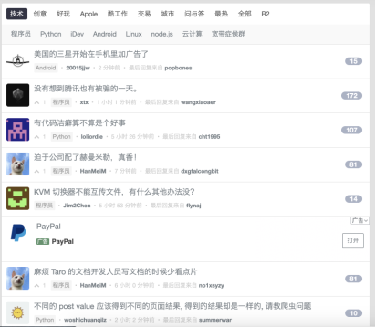
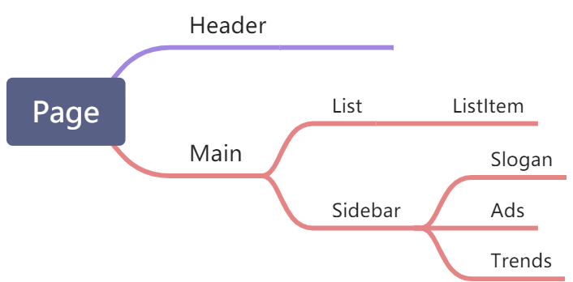
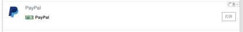
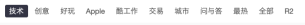

# 组件化

组件化是现代前端开发中一个最基础的概念。

## 组件的特点

**组件是前端页面中，可重复利用的最小单元**。我们可以把页面拆分为多个组件，比如导航栏，列表，工具栏等等。组件有如下的特点：

- 组件包含了在功能上内聚的 **UI（HTML/CSS）**和这块 UI 和用户交互时对应的**逻辑（JavaScript）**
- 组件可以**组合**，就和 DOM 节点一样，组件可以嵌套子组件，页面中的所有组件会组成一个组件树，根节点就是页面
- 因为组件可以组合，所以组件的功能有大有小。小到按钮，输入框，大到导航栏，列表，对话框。小的组件，比如按钮之类，往往会被复用，我们叫**通用组件**，因此会写在一个统一的目录下。如果把一些常用的通用组件单独拿出来集合为一个 NPM 包，就叫做**组件库**，可以在多个不同的前端应用中复用。（推荐看一下 [antd 组件库](https://ant.design/components/overview-cn/)，来具体感受一下通用组件有哪些）
- 组件有**生命周期**，一个组件一般是一个 JS Class 或者函数，组件会被创建（初始化），渲染（运行组件的渲染函数，展示 UI，此后用户可以和组件进行交互，交互过程中可能会触发新的渲染流程 ），销毁（比如页面切换时）

## 组件化思维

在实际的前端开发过程中，重要的是养成一种组件化的思维。当看到一份 UI 设计稿时，就可以将页面用组件去拆分，自顶向下，构建出一个组件树。页面由多个子组件组成，子组件又有各自的子组件，由此，像搭积木一样，层次积累起来。

组件的拆分中，组件由两个类型

1. 业务组件，指只能在当前页面中使用，包含了特定业务逻辑或者 UI 的组件。
1. 通用组件，指可以在不同页面之间复用的组件，主要包括基础（原子）组件以及一些可复用的复杂组件。

这样讲比较抽象，我们以一个具体的网页为例子，说说如何拆分组件。

组件拆分的原则就是由大到小，先拆出页面里最顶层的几个组件，然后对每个组件分别进行拆解，这是一个递归的过程。

顶层组件

**Header**：

**Main**：

对 Main 组件我们可以进行进一步的拆解：

**List**：

**Sidebar**：

Sidebar 和 List 又分别可以拆解，比如 Sidebar 可以拆为上面的 Slogan 中间的 Ads 和最下面的 Trends。List 里面可以对每一行列表项拆出一个组件。

这里给出整个页面的一个参考的拆分方式：

到这里我们就拆完了业务组件，接下来我们看看通用组件。我们在看页面设计稿的时候会发现，有一些原子级（不可拆分）的 UI 元素，在所有页面中的样式都是统一的，比如：

按钮：   标签 )  等等。
也有一些比较大的组件，但这些组件在其他页面中也会被复用，比如列表中的广告：

以及列表上的标签式 Tab 导航：

简单的说，如果你发现一个组件会在其他页面被用到，或者判断这个组件在未来会被用到，就应该抽为通用组件，放到一个公共的目录下。

如何养成这种判断力呢，除了之前说的，在页面之间复用，并且 UI 类似外，还有几个窍门：

1. 去详细浏览 antd/antd mobile/taro-ui 这样的组件库，对前端常见的通用组件有了解，有深刻的印象（PC 中后台页面和移动端/小程序的通用组件有一些差别，需要针对性的看特定场景下最流行的组件库）。
1. 识别出组件的功能而不是 UI，比如 Tab 导航和广告，都是一种比较常见的功能，所以大概率在其他页面也会被用到。

此外，也不要一味的追求通用组件，比如上面 Header 里的 Search 搜索组件，除了 Header 之外的地方可能没有这样的搜索场景，所以直接放 Header 组件里就可以，这要具体问题具体分析。

并且，在实际的代码编写过程中，你会有很多机会去识别出通用组件，有时候我们会在初版完成，后续迭代的时候，对代码进行重构，把之前没有抽出的通用组件抽出来。所以如果遇到模棱两可的场景，不用太纠结，先高质量的完成代码编写，后面再看是否要抽为通用组件。

## GUI 开发中的组件化思想

前端属于 GUI 应用开发，和安卓/iOS/Windows 客户端开发本质上是一样的。所以我们可以看看其他端是否有组件的概念。

以安卓为例，安卓中也有类似前端组件的概念，叫 widget，中文叫控件。安卓系统内置了很多的控件，比如按钮，输入框，Checkbox，列表容器等等。这些控件有着和前端组件一样的特点，可以组合，有生命周期，包含了 UI 和逻辑。安卓中 UI 用 XML，逻辑用 Java，前端 UI 用 HTML/CSS，逻辑用 JavaScript，可以说是非常相似了。

和安卓最大的不同是，前端的 Web 生态，是一个开放的生态，浏览器当初的作用也是用来浏览 HTML 页面，所以前端没有官方内置的原生组件库。因此我们在开发前端应用的时候，经常会需要引入第三方的组件库，比如 antd，来让我们可以不用重复开发基础组件。

> 前端开发者可以多看看安卓/iOS/PC 的 GUI 开发，就会发现 GUI 开发的很多思想是通用的。同时也会开拓一些思路，有更广的视野。
