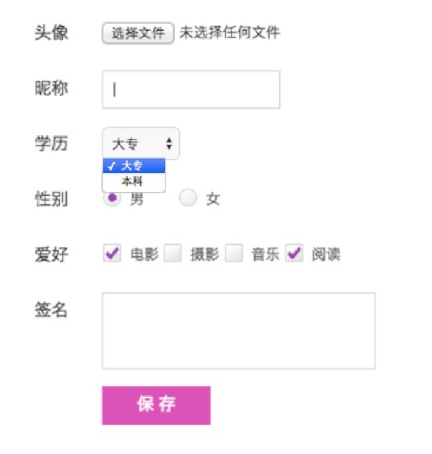
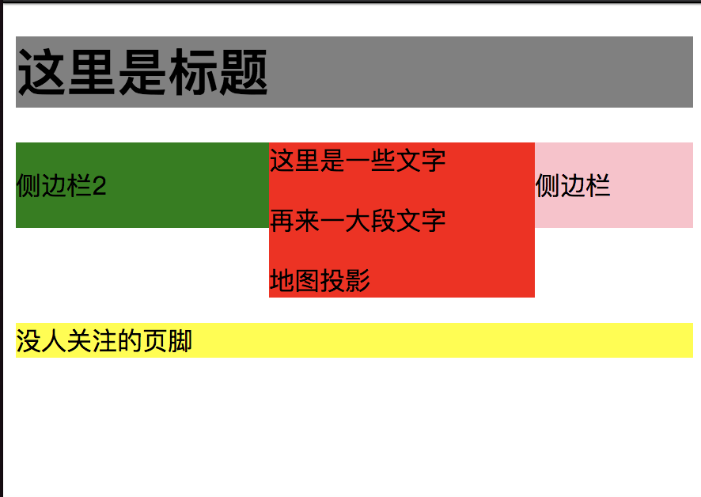
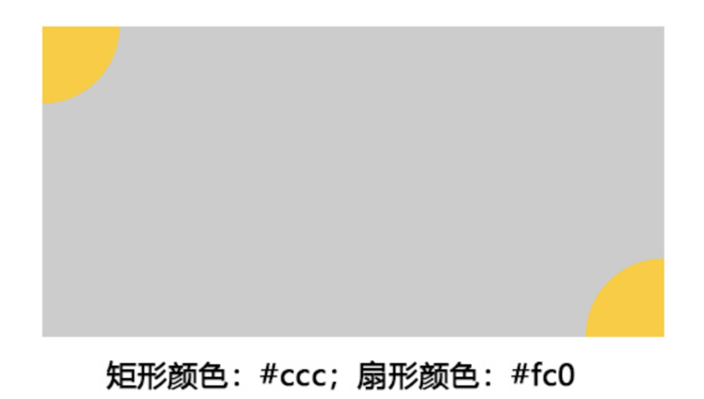

# 大一上学期

> 编写中

## 模块一：HTML + CSS 基础

- 学习 HTML 和 CSS，参考资料：
  - [HTML-MDN](https://developer.mozilla.org/en-US/docs/Web/HTML)
  - [CSS-MDN](https://developer.mozilla.org/en-US/docs/Web/CSS)
  - [学习 CSS 布局](http://zh.learnlayout.com/)
  - [Flex 布局](https://css-tricks.com/snippets/css/a-guide-to-flexbox/)

**完成以下 Task(每周完成一项 task）**（保存在[JSBIN](http://js.jirengu.com/)里，完成任务后把链接发到自己的进度文档中）

### Task1

请实现以下表格的**HTML**部分

提示：注意`<thead>`,`<tbody>`的使用

---

### Task 2

请实现以下表单的 HTML 部分


---

### Task3

修改这个[模板](https://codepen.io/anon/pen/VBwqaL)，通过 CSS 实现以下效果


要求使用浮动布局方法，并需要清除浮动。

---

### Task4

- 实现 [A Guide To Flex](https://css-tricks.com/snippets/css/a-guide-to-flexbox/)中最后的练习
- 实现以下效果（Flex 布局实现垂直居中）：
  
- 修改[模板](https://codepen.io/anon/pen/RBwEvg)实现以下效果（通过 Flex 布局实现水平居中，替换当前 display:inline 实现）：
  

---

### Task5

实现如下效果：
Tips:两个扇形定位在矩形的两角，矩形水平垂直居中，通过绝对定位实现


---

### Task6

分别通过“两边自适应，中间定宽”和“两边定宽，中间自适应”的方式实现基本效果：


## 模块二：页面重构

### Task 1

重构[学而](/101/xueer.png)首页，做出一个和它一模一样的页面出来。并使用 Github 的 gh-pages 分支部署静态页面。

_团队内同学可以访问蓝湖上的设计稿，看标注和样式比较方便。具体链接团队内获取_

要求：

- HTML 与 CSS 分离（样式与结构分离）。
- 像素级还原。
- 只需实现静态页面。JS 效果不要求，比如推荐选项卡切换，点击按钮查看更多之类的都不用。
- 注意页面为**定宽居中**布局。
- 注意通过重复使用同一个 Class，或者组合不同的 Class 来复用样式。
- 使用 Git 作为版本控制工具，利用 Github 的 gh-pages 分支托管页面。最后在进度里发链接。

## 模块三：JavaScript 基础

> TODO 补充 JS 的历史和介绍

木犀前端组唯一官方指定权威教材：[Eloquent JavaScript (第三版)](http://eloquentjavascript.net/)

- [中文翻译](https://wizardforcel.gitbooks.io/eloquent-js-3e/content/)

_推荐阅读英文原版，中文翻译作为参考_

参考资料：

- [JavaScript学习指南 第3版](https://item.jd.com/12123997.html) 推荐购买，作为语言语法和特性的参考书
- [MDN JavaScript 指南](https://developer.mozilla.org/zh-CN/docs/Web/JavaScript/Guide)

> TODO EloquentJS 每章的解（导）读

### Task 1：基础语法

阅读教材第 **1-2** 章并**完成书上习题，上传到 Github**
可以在[这里](https://eloquentjavascript.net/code/)测试代码

推荐流程：先看书，W3cshool 和 MDN 的教程先看基础语法部分。然后试着自己写一下（自己练习 JS 可以用 JSBin/CodePen/本地 HTML 文件/浏览器 Console/Nodejs 等多种环境），刷题中遇到困难多 Google

**知识要点：**

_第一章_

- 值：计算机中所有数据的都是一个值，存储方式是二进制的编码。这部分是很关键的计算机基础知识，可以看[《编码》](https://item.jd.com/11116026.html)这本书了解
- 基本数据类型：数字，字符串，布尔，_null 和 undefined_
- 运算符：算术，一元（unary），比较，逻辑。逻辑运算符比较常用，要了解*短路特性*。
- JS 的自动类型转换。JS 是*弱类型语言*，不同类型之间会有*隐式转换*。

_第二章_

- 表达式和语句
- 变量（绑定），使用 var，const，let 关键字，了解*三者之间的区别*
- 变量名的规则，保留字不能作为变量名，同时变量名不能以数字开头，也不能包含 \$ 或者 \_ 之外的特殊字符
- 函数的概念，调用的方式
- 函数的返回值和*副作用*
- 控制流：条件，循环，switch 语句
- 跳出循环的方式，for 循环常用的 ++，+=，-=，-- 等操作符
- 驼峰命名法
- 注释

针对上面知识点中，斜体的关键字，可以自行搜索资料，进一步了解，写一些总结学习的博客或者做一些分享。

### Task 2：函数

函数是 JS 中的**一等公民**，也是程序运行的主要单位。将逻辑封装为一个一个职责单一的函数，避免重复的编写代码，可以让整个程序的可读性，可维护性都大大提升。

阅读教材第 **3** 章并**完成书上习题，上传到 Github**

知识要点：

+ 函数定义的方式。函数表达式 vs 函数声明。函数声明要注意声明提升
+ 函数的返回值：可以有，可以没有，没有则默认返回 undefined。函数可以制造副作用，也可以返回值
+ 作用域：全局作用域，函数作用域，块级作用域
+ 作用域可以层层嵌套，形成一个作用域链
+ 作用域可以继承（看到/引用）上层作用域的变量，但不能看到子作用域的
+ 词法作用域
+ 箭头函数
+ 调用栈
+ 函数的参数，参数默认都是可选的。可以指定参数的默认值
+ 递归的概念
+ 闭包的概念
+ 添加函数的时机，什么时候应该新增一个函数？
+ 副作用与纯函数的概念


函数很重要，本章的内容比较多，因此推荐花一些时间对一些概念做**针对性学习**（推荐谷歌和知乎搜索）：

+ 编程语言中作用域的概念
+ JS ES6 新增的词法作用域是指什么？之前 JS 的作用域是什么样的（这部分和前一个 Task 的 let,const vs var 关键字有很大联系）
+ 词法作用域 vs 动态作用域
+ 闭包的概念
+ 纯函数是指什么？什么时候应该写纯函数
+ 什么时候应该新增一个函数？（学好这个对于写优雅的代码至关重要）

### Task 3：对象，数组以及字符串

阅读教材第 **4** 章并**完成书上习题，上传到 Github**

### Task 4：高阶函数 && 面向对象 && 原型

阅读教材第 **5-6** 章并**完成书上习题，上传到 Github**

<!-- 自测练习：回答问题并说明原因

1.

```
var a = function(){}
a.b = 1
a.prototype.b = 2
a.prototype.c = 3
a.prototype.d = 4
console.log(a.b)
console.log(new a().b)

var foo = new a()
foo.c = 5
console.log(foo.c)
console.log(foo.d)
```

请问`console.log`的输出？

---

2.

```
var Foo = function(){
  this.a = 1
  return {
    a:2
  }
}

var bar = new Foo()
console.log(bar.a)
```

请问`console.log`的输出？

---

3.

```
var map = Object.create(null);
console.log("toString" in map);

var map = Object.create({a:1});
console.log("toString" in map);
console.log("a" in map);
```

请问`console.log`的输出？

---

4.

```
function foo(obj){
  return Object.prototype.toString.call(obj).slice(8,-1)
}

```

请说明函数`foo`的作用

---

5.

```
var a = {}
a.bar = 2

Object.defineProperty(a, "foo",
                      { value: "hi"});

console.log(delete a.foo)
console.log(delete a.bar)

a.foo = "world"
console.log(a.foo)


for (var key in a){
  console.log(key);
}

console.log("foo" in a);
console.log("bar" in a);
```

请问`console.log`的输出？

---

6.

```
var a = 1;

function test() {

	a = 0;

	console.log(a);

	console.log(this.a);

	var a;

	console.log(a);

}
test();
new test();
```

请问`test()`和`new test()`的输出分别是什么

---

7.

```
function foo(){
    f = function(){
        console.log('1');
    }
    return this;
}
foo.f = function(){
    console.log('2');
}
foo.prototype.f = function(){
    console.log('3');
}
var f = function(){
    console.log('4');
}
function f(){
    console.log('5');
}
//写出下面的结果
foo.f();
f();
foo().f();
new foo.f();
new foo().f();
new new foo().f();
```

写出结果说明原因

---

### Task3：

完成[JS 练习](https://hk.tower.im/projects/8b4990dc9e324866a0357c7a0dda0d5d/docs/f53eb2b6e8e645ed9d3b05f16f3ddd4a/) 上传 github -->

## 模块四：前端工程化基础与 JavaScript 进阶

前端开发中，起初只要在 `<script/>` 标签中嵌入几十上百行代码就能实现一些基本的交互效果，后来随着个人电脑性能提升和智能手机的普及以及编译器技术的发展，JavaScript 的性能得到了很大的提升。基于 Web 技术的复杂应用不断出现，JavaScript 面临着构建大型软件的挑战。Java/C++/C# 等等语言都有着面向对象特性，模块系统，静态类型检查等等特性，JavaScript 在一开始的设计中，没有考虑到这些，在基于 Web 技术构建大型软件越来越普遍的今天，这些特性都会慢慢补上。

一个模块是以一个 JS 文件为单位的，模块和模块之间有变量的隔离，因此 JS 的全局变量污染这样的问题在模块化的 JS 中将不再是问题。模块还方便了代码复用和依赖分析等等。我们接下来就来了解一下 JS 模块化的来龙去脉：

浏览一遍这些材料，了解模块化：

**模块化的原因和历史**

1. [网易前端架构-JS 模块化视频](http://pan.baidu.com/s/1pK6jxIr#path=%252Fjs%25E6%25A8%25A1%25E5%259D%2597%25E5%258C%2596)
2. [JS 模块化七日谈](https://github.com/Huxpro/js-module-7day)

**模块化的综合介绍**

3. [JS 教材第 10 章](http://eloquentjavascript.net/3rd_edition/10_modules.html)
4. [Programming JavaScript Applications-Chapter 4. Modules](https://www.safaribooksonline.com/library/view/programming-javascript-applications/9781491950289/ch04.html)

**ES6 模块**

5. [Understanding ECMAScript 6-Modules](https://leanpub.com/understandinges6/read/#leanpub-auto-modules)

然后我们用 CommonJS 规范来写 js 模块，这里还需要用到[webpack](https://webpack.js.org/guides/getting-started/)作为打包工具。

**task：**
构建一个项目，在项目中编写 3 个 js 文件，其中 module1 导出一段字符串，module2 导出一个如下所示的函数

```
function(str){
    document.write(str.split("").join(','));
}
```

其中实现 module3 依赖 module1 和 module2，将 module1 的字符串作为参数调用 module2 的函数

最后用 webpack 打包出来 bundle.js 文件，在 html 文件中引用。将项目上传 github，记得.gitignore

目录结构:


### js 练习和深入学习

- 继续完成[JS 练习](https://hk.tower.im/teams/85051/documents/2798/) 上传 github
- 继续阅读[《Javascript 编程精解》(第三版)](http://eloquentjavascript.net/)
- 了解[ECMAScript 6 入门](http://es6.ruanyifeng.com/)

## 模块五：基于 Web 技术的多端 GUI 应用开发原理

### GUI 应用简介

### JavaSript 与浏览器：DOM 与 事件

### JavaSript 与移动端应用

### JavaSript 与小程序

## 模块六：网络基础
