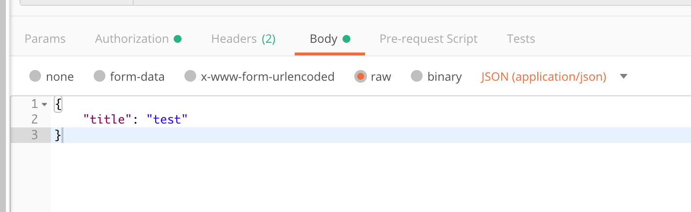

# Lab: 使用 HTTP API 操作 Github issues

### 介绍

在学习了 HTTP 的理论知识，以及 Restful API 规范，JSON 格式等相关知识之后，我们了解到，可以通过 HTTP 协议在网络中传输数据。这是网页/App 和后端服务通信的最常见的方式。

但除非进行 App 开发的实战，不然我们对这种前后端通信方式还是没有实际的感觉。因此这个 Lab 就利用了现成的后端服务：Github，来让我们动手发送 HTTP 请求，调用各种 API 来完成一些操作。

Github 提供了开放 API，也就是说他把 API 的路径和调用方式都写成了文档，为的是第三方开发者可以开发 Github 相关的功能。

这次我们将通过 API 的方式来完成 Github 仓库 issue 的查看，创建，更新和删除。这些操作可以直接在网页上完成，但我们这次不使用页面，而是直接通过 HTTP 调用完成。

> 注意：Github 的 API 可能随着时间变化，版本有更新，所以文中有些内容不一定是准确的。在执行的时候需要对照 Github 的文档执行。

### 准备工作

- 注册 Github 账号
- HTTP/Rest API/JSON 等相关知识学习
- 新建一个 Github 仓库 restapi-lab
- 下载安装一个 Postman
- 对一个开源项目来说，issue 主要是作为问题追踪器存在的，也兼备讨论区的功能。对我们来说，可以暂时把 issue 理解为一个开放的讨论区，可以发帖（创建 issue），评论 等等。这样会更好理解一些。

### 创建 Personal Token

大家在看 HTTP 协议的时候，应该也看到了 HTTP 可以携带一些认证信息。利用 [Authorization](https://developer.mozilla.org/en-US/docs/Web/HTTP/Headers/Authorization) 这个 Header，我们可以使用规定的格式，编码一些用户信息，传给服务端。Authorization 字段的格式，比如直接传递用户名和密码的 [Basic](https://tools.ietf.org/html/rfc7617) 格式或者通过 Token 认证的 Bearer token 这样的机制。

传递这个信息的目的是显而易见的。如果没有认证信息，服务端就不知道发起请求的人是谁，就无法完成一些需要权限的操作。一个用户想要创建一个 issue，显然只有登录用户自己的账号才可以。其他人不能冒名顶替。所以 Authorization 字段传递的就是当前认证（登录）的用户的信息。

Github 支持 Basic 和 Bearer 两种模式，Bearer 是更推荐使用的，因为传递 Token 比直接传输密码更安全。

在 Github 中，为了防止密码泄露的风险，我们可以创建一个 Personal Token，可以理解为一个临时的密码，用来在 API 调用中进行认证。比直接使用密码要更安全。如果这个 token 泄露，我们可以随时把 token 置为失效。

创建 Personal Token 可以参考[教程](https://docs.github.com/en/free-pro-team@latest/github/authenticating-to-github/creating-a-personal-access-token)。需要注意的是 Github 上的 Personal Token 一旦创建，后面关闭页面以后就再也拿不到了（类似阅后即焚）。需要自己保存好。这也是一个安全上的考虑。

有了 Personal Token 之后，我们可以在 Postman 发送一个请求来测试 Token 是否有效。

在 Postman 发送一个 GET 请求到 `https://api.github.com`。Authorization 的 Type 选择 Bearer Token，然后在 Token 输入框里面填入刚才拿到的 Personal Token。点击 Send 发送！

如果一切正常，你就可以看到这样的返回。如果返回了 401 或者其他状态码，就说明 Personal Token 有误。

```json
{
	"current_user_url": "https://api.github.com/user",
	"current_user_authorizations_html_url": "https://github.com/settings/connections/applications{/client_id}",
	"authorizations_url": "https://api.github.com/authorizations",
	"code_search_url": "https://api.github.com/search/code?q={query}{&page,per_page,sort,order}",
	"commit_search_url": "https://api.github.com/search/commits?q={query}{&page,per_page,sort,order}",
	"emails_url": "https://api.github.com/user/emails",
	"emojis_url": "https://api.github.com/emojis",
	"events_url": "https://api.github.com/events",
	"feeds_url": "https://api.github.com/feeds",
	"followers_url": "https://api.github.com/user/followers",
	"following_url": "https://api.github.com/user/following{/target}",
	"gists_url": "https://api.github.com/gists{/gist_id}",
	"hub_url": "https://api.github.com/hub",
	"issue_search_url": "https://api.github.com/search/issues?q={query}{&page,per_page,sort,order}",
	"issues_url": "https://api.github.com/issues",
	"keys_url": "https://api.github.com/user/keys",
	"label_search_url": "https://api.github.com/search/labels?q={query}&repository_id={repository_id}{&page,per_page}",
	"notifications_url": "https://api.github.com/notifications",
	"organization_url": "https://api.github.com/orgs/{org}",
	"organization_repositories_url": "https://api.github.com/orgs/{org}/repos{?type,page,per_page,sort}",
	"organization_teams_url": "https://api.github.com/orgs/{org}/teams",
	"public_gists_url": "https://api.github.com/gists/public",
	"rate_limit_url": "https://api.github.com/rate_limit",
	"repository_url": "https://api.github.com/repos/{owner}/{repo}",
	"repository_search_url": "https://api.github.com/search/repositories?q={query}{&page,per_page,sort,order}",
	"current_user_repositories_url": "https://api.github.com/user/repos{?type,page,per_page,sort}",
	"starred_url": "https://api.github.com/user/starred{/owner}{/repo}",
	"starred_gists_url": "https://api.github.com/gists/starred",
	"user_url": "https://api.github.com/users/{user}",
	"user_organizations_url": "https://api.github.com/user/orgs",
	"user_repositories_url": "https://api.github.com/users/{user}/repos{?type,page,per_page,sort}",
	"user_search_url": "https://api.github.com/search/users?q={query}{&page,per_page,sort,order}"
}
```

> 关于 Basic vs Bearer 两种 Authorization 格式的优劣对比，可以参考这个 [Stack Overflow 回答](https://stackoverflow.com/questions/34013299/web-api-authentication-basic-vs-bearer)

### 创建 issue

我们可以在 Github API 文档中找到 [Create an Issue](https://docs.github.com/en/free-pro-team@latest/rest/reference/issues#create-an-issue) 这个 API。


我们看到请求方法的 POST。路径是 `/repos/{owner}/{repo}/issues`。其中 owner 就是你自己的 Github 账户名（id，不是邮箱），repo 是之前我们创建的 restapi-lab。这边只给了一个路径，域名没有写，域名就是 Github 的 API 主域名： `https://api.github.com`。

所以最后完整的 URL 是 `https://api.github.com/repos/{owner}/{repo}/issues`，注意替换里面的参数。

在 Postman 中发送这个请求，同时也要带上之前的拿到的 Token。

这是一个 POST 请求，所以需要有请求体。这个请求的参数我们在 API 文档中也可以看到，是一个表格。里面有很多创建 issue 需要的参数。但其实只有一个是必填的。

```
title	string	body	Required. The title of the issue.
```

就是标题，这里写了 Required。其他的参数比如 labels 是 issue 的标签，body 是 issue 的详情描述。这些都是可选的。在页面上发 issue 的时候也可以看出来。只填一个标题就行了。在未来的应用开发中，我们也可能会有一些 API 的参数是可选的，这主要是根据实际的业务需求来设计的。

所以我们先传这个参数。Github 的 API 的请求题都是基于 JSON 格式传输的。在 Postman 中我们可以在 Body 中选择 raw 然后选择 JSON。在编辑器里输入 JSON 格式的参数：



点发送，成功的返回如下：

```json
{
	"url": "https://api.github.com/repos/zxc0328/restapi-lab/issues/4",
	"repository_url": "https://api.github.com/repos/zxc0328/diary",
	"labels_url": "https://api.github.com/repos/zxc0328/restapi-lab/issues/4/labels{/name}",
	"comments_url": "https://api.github.com/repos/zxc0328/restapi-lab/issues/4/comments",
	"events_url": "https://api.github.com/repos/zxc0328/restapi-lab/issues/4/events",
	"html_url": "https://github.com/zxc0328/restapi-lab/issues/4",
	"id": 760262711,
	"node_id": "MDU6SXNzdWU3NjAyNjI3MTE=",
	"number": 4,
	"title": "test",
	"user": {
		"login": "zxc0328",
		"id": 10339692,
		"node_id": "MDQ6VXNlcjEwMzM5Njky",
		"avatar_url": "https://avatars0.githubusercontent.com/u/10339692?v=4",
		"gravatar_id": "",
		"url": "https://api.github.com/users/zxc0328",
		"html_url": "https://github.com/zxc0328",
		"followers_url": "https://api.github.com/users/zxc0328/followers",
		"following_url": "https://api.github.com/users/zxc0328/following{/other_user}",
		"gists_url": "https://api.github.com/users/zxc0328/gists{/gist_id}",
		"starred_url": "https://api.github.com/users/zxc0328/starred{/owner}{/repo}",
		"subscriptions_url": "https://api.github.com/users/zxc0328/subscriptions",
		"organizations_url": "https://api.github.com/users/zxc0328/orgs",
		"repos_url": "https://api.github.com/users/zxc0328/repos",
		"events_url": "https://api.github.com/users/zxc0328/events{/privacy}",
		"received_events_url": "https://api.github.com/users/zxc0328/received_events",
		"type": "User",
		"site_admin": false
	},
	"labels": [],
	"state": "open",
	"locked": false,
	"assignee": null,
	"assignees": [],
	"milestone": null,
	"comments": 0,
	"created_at": "2020-12-09T11:51:17Z",
	"updated_at": "2020-12-09T11:51:17Z",
	"closed_at": null,
	"author_association": "OWNER",
	"active_lock_reason": null,
	"body": null,
	"closed_by": null,
	"performed_via_github_app": null
}
```

去你创建的 Github 仓库的 issue 列表看看吧，已经有一条通过 API 创建的 issue 躺在那里了！这是不是很神奇？！

如果失败了，请仔细检查 URL，Token，Body 这些是否都带上了。Postman 左上角有个 Code 按钮，可以查看当前配置的请求最终生成的 HTTP 请求，可以方便的 Debug。

### 获取 issue 列表和详情

详细讲解了第一个 API 的使用后，后面的 API 调用其实是大同小异。这个时候我们需要在 Postman 中点 + 号创建一个新的请求（可能后面还要用之前创建的请求），然后继续填写参数。

首先我们可以通过列表接口，获取到仓库的 issue 列表，我们看看列表中有没有我们之前创建的 issue。

[List Repository Issues](https://docs.github.com/en/free-pro-team@latest/rest/reference/issues#list-repository-issues)

然后我们可以通过 issue 详情接口，获取 issue 的内容：

[Get an Issue](https://docs.github.com/en/free-pro-team@latest/rest/reference/issues#get-an-issue)

### 更新 issue

接下来我们可以对 Issue 做更新：

[Update an Issue](https://docs.github.com/en/free-pro-team@latest/rest/reference/issues#update-an-issue)

更新之后可以再用之前的 Get 接口看看是否更新成功。

### 发表 issue 的评论，列出 Issue 评论

Issue 可以被评论，我们可以通过接口发表评论：

[Create an Issue Comment](https://docs.github.com/en/free-pro-team@latest/rest/reference/issues#create-an-issue-comment)

发表后可以通过 List 接口查看评论：

[List Issue Comments](https://docs.github.com/en/free-pro-team@latest/rest/reference/issues#list-issue-comments)

### 拓展

- Issue 有状态，可以被打开（open）或者关闭（closed）。这个状态的更新可以通过哪个接口实现？试试你能不能通过 API 修改一个 issue 的状态
- 浏览 Github API 的 [Reference](https://docs.github.com/en/free-pro-team@latest/rest/reference)，这里列出了所有的 API。这些 API 是按什么规律归类的？每种类别点进去之后右侧的目录又是按什么归类的？这说明 API 设计和编写应该按什么思路？
- 除了 Postman，还有什么工具可以用来发送 HTTP 请求？尝试其他的工具，比如 `curl` 和 [`telnet`](https://blog.csdn.net/gobitan/article/details/4790049)。
- 尝试在浏览器中，通过 fetch API 发送 HTTP 请求给 Github。
- 在浏览器中有[跨域限制](https://cloud.tencent.com/developer/article/1504163)，为什么 Github API 不会报跨域错误？它是通过哪种办法实现跨域的？
- 通过 Header 传信息认证是一种方式，HTTP 和浏览器支持一种叫 Cookie 的特性，这是更传统的传递认证信息的方式。这两者的差异是什么？我们应该如何选择？可以对 Cookie 做一些了解，然后参考 [Stack Overflow 回答](https://stackoverflow.com/a/35059874)。

### 总结

通过这个 Lab，我们实战了 HTTP 请求的发送，通过使用 Github 提供的 REST API，实现了对 issue 资源的增删改查。

一方面大家对 HTTP 和 REST API 有了实际的感受。另一方面，也希望大家通过对 Github API 的使用，了解到怎样的 API 是好用的，怎样的设计才是比较经典的 REST API 设计。接口一般是后端编写，但接口的定义是前后端一起讨论的。所以大家也需要了解相关的知识。

如果觉得这个 Lab 对你有帮助，请在博客，进度，等等地方公开的写一下自己的收获，分享交流，多多思考，这样才能真正的吸收知识。
