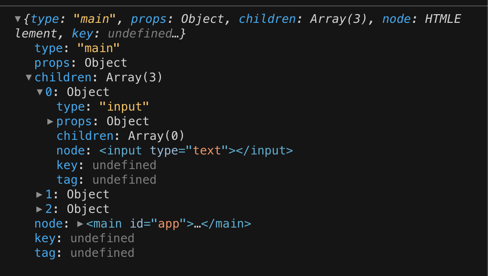

# Lab: 使用 Hyperapp 编写 TodoList


## GUI 编程：一个由组件构成的世界


前端方向所编写的主要是运行在 Web 浏览器中的 GUI（图形化用户界面）应用程序。包括简单的新闻页面，到复杂的在线 [Office 等应用](https://shimo.im/)，都可以在浏览器内实现。

> 这是比较狭义的前端。目前广义的大前端工程师也会做一些服务端和客户端的研发。但对前端来说，编写用户界面始终是核心的话题。

之前大家也写过页面。页面是由很多个相互嵌套的标签构成的。如果我们把页面内容按页面的结构分组，就可以分出很多的组件（Component）。

写组件，主要是通过 JavaScript 实现的。原因如下：

+ 像之前写页面那样，直接写 HTML 和 CSS，就无法实现组件化的，因为组件化的前提是模块化。**只有 JS 有模块化的能力**。
+ 组件除了结构（HTML）和样式（CSS）之外，最主要的是**交互逻辑**，也就是这个组件会响应用户的操作，对页面进行动态的修改。以及和服务端交互，发送网络请求获取数据，展示在页面中等等。这部分逻辑是通过浏览器的 API 实现的，主要是 DOM 相关。比如我们可以使用 DOM API 去动态的增加元素，修改元素。我们可以用 `addEventListener` 来添加事件，响应用户交互。用 fetch API 发送网络请求。这些交互逻辑显然只能在 JS 中实现。

所以对于前端中的组件化，一个组件就是一个 JS 模块，这个模块控制了页面某块区域的**结构，样式，和用户交互逻辑**。

> 如果对组件化还有疑问，可以看[这篇专题](/101/fe/component.html)。里面用一个页面作为例子，讲了具体的组件拆分方式。

GUI 编程其实就是一个搭积木的过程，拆分组件，若干个组件拼成一个页面，所有的页面加起来，就构成了一个应用程序（Application）。

看到这里，你可能对如何使用 JS 写一个应用，如何写一个组件，还是没有概念。接下来我们就会借助一个第三方库：Hyperapp，来实现 GUI 编程。


## Hyperapp：入门实例

一般学一种新的技术，我们都会看一个 Hello World 例子。

[Hyperapp](https://github.com/jorgebucaran/hyperapp) 的 Github 主页上就有一个例子：

```html
<!DOCTYPE html>
<html lang="en">
  <head>
    <script type="module">
      import { h, text, app } from "https://unpkg.com/hyperapp"

      const AddTodo = (state) => ({
        ...state,
        todos: state.todos.concat(state.value),
      })

      const NewValue = (state, event) => ({
        ...state,
        value: event.target.value,
      })

      app({
        init: { todos: [], value: "" },
        view: ({ todos, value }) =>
          h("main", {}, [
            h("input", { type: "text", oninput: NewValue, value }),
            h("button", { onclick: AddTodo }, text("Add")),
            h("ul", {},
              todos.map((todo) => h("li", {}, text(todo)))
            ),
          ]),
        node: document.getElementById("app"),
      })
    </script>
  </head>
  <body>
    <main id="app"></main>
  </body>
</html>
```

因为只是一个简单的例子，所以不会使用之前的 Lab 那样用 Webpack 做构建。大家可以在本地新建一个 HTML 复制以上内容，就可以运行例子了。如果是在线 Demo 的话，我们常用 [CodeSandbox](https://codesandbox.io/)。

这个例子实现的就是一个简单的 TodoList，用户可以添加 todo，添加之后的 todo 会展示在列表中。但它没有删除 todo，编辑 todo，标记 todo 为完成，筛选等等功能，这也是后面我们需要完善的。

在完善 Todo 之前，我们首先要学习 Hyperapp 这项技术。这是一个第三方 JS 库，可以简单的理解为是某一个开发者编写的一些 JS 包，这些包的可以帮助我们搭建组件化的的 Web 应用。在 GitHub 仓库里，我们可以看到 [index.js](https://github.com/jorgebucaran/hyperapp/blob/main/index.js)，这就是 Hyperapp 的源代码。一共 400 多行。讲这些是想告诉大家，我们 npm install 的那些包，也是用 JS 写的普通代码，并没有什么神奇的。我们以后也可以自己写一个库，发布成 npm 包。

在学技术的时候，尤其是对于初学者，要注意**不求甚解**，也就是先对技术的使用有一个基本了解，不要太钻牛角尖。因为一项技术往往会有自己的设计理念，会引入一些新的概念。我们首先要充分吸收，然后慢慢的理解。等到后期接触过很多相关技术了，再回头看一些新技术，就会有自己的认知和评判。

> 除了计算机基础知识和前端的基础（HTML/CSS/JS/Web API）之外，对于一些上层的框架和库，在初学的阶段，直接按本教程推荐的学即可。在后期养成鉴别能力之后，对于一项新技术，可以自通过看文档，源代码等等来评判一个框架是否值得学习。

接下来我们首先来看看 Hyperapp 的一些基础概念：

## 核心概念：视图（view）

我们先笼统的看一下以上的例子。这段 JS 里最核心的是 app 的函数调用，调用时传入了一个对象作为参数。app 就指的是 application，就是一个 Web 应用。一般一个应用都会有一个初始化的地方，负责启动整个应用，在 Hyperapp 里，调用 app 函数就初始化了整个应用。

app 的参数有三个，init，view 和 node。node 很好理解，就是这个 app 会渲染在哪个 DOM 节点里。在组件化的前端开发中，DOM 结构一般都是动态创建的，所以需要给一个节点作为插入子元素的容器节点。

view 是一个函数。view 返回的就是 app 的视图结构，其实就是页面的 DOM 结构。里面用到了名为 h 的函数。我们可以简单的把 h 函数的作用理解为 `document.createElement`，是用来创建 DOM 元素的。这里不直接用 DOM API，而是用 Hyperapp 提供的函数，是因为 Hyperapp 会处理所有的 DOM 操作，你只需要提供给它一个 DOM 结构的**描述**即可。

h 这个函数第一个参数是要创建的 DOM 节点的标签名，第二个参数是传给 DOM 节点的属性，第三个参数是节点的子元素数组。调用之后返回的是一个对象：



对象的结构是：

```typescript
interface VNode = {
  type: string; // DOM 节点的标签名
  props: Object; // DOM 节点的属性，key-value 对象
  children: Array<VNode> // 子节点，节点结构一致
  node: Element; // 对应的真实 DOM 节点
  key?: string; 
  tag?: string;
}
```

这种模式一般叫做虚拟 DOM。就是说我们在写视图层代码时，只创建 JS 对象，描述 DOM 元素结构，再由框架去帮我们创建真正的 DOM 节点。这样的好处在后面会讲到。目前大家只需要习惯用这种方式去描述 DOM 结构即可。不要对 h 函数有畏惧。h 函数只是一个返回 JS 对象的函数而已。

> 用对象 + 属性的方式，去描述一个实体，这就是一种抽象。DOM 元素的主要特点是，有一个标签名，有一些属性，可能有一组子元素。这就对应了 h 函数的三个参数。是对实际 DOM 元素的一种抽象。这种技巧在编程中非常常见。软件开发本身，很大程度上是对现实世界的抽象。而在计算机系统的分层架构中，也存在着很多的抽象。抽象让我们抛开事物的繁杂，只抓住其中的重点。这样可以显著的降低用户或者软件开发者所面对的复杂度。

## 小练习：使用 Hyperapp 创建 DOM 结构

让我们来练习一下使用 Hyperapp 的 view 和 h 函数来创建 DOM 结构，使用 Hyperapp，渲染如下的 HTML：

```html
<div id="app" class="container">
    <div class="filter">
        Filter:
        <span class="filter-word">ocean</span>
        <button>&#9998;</button>
    </div>
    <div class="stories">
        <ul>
            <li class="unread">
                <p class="title">The <em>Ocean </em>is Sinking</p>
                <p class="author">Kat Stropher</p>
            </li>
            <li class="reading">
                <p class="title"><em>Ocean </em>life is brutal</p>
                <p class="author">Surphy McBrah</p>
            </li>
            <li>
                <p class="title">
                    Family friendly fun at the
                    <em>ocean </em>exhibit
                </p>
                <p class="author">Guy Prosales</p>
            </li>
        </ul>
    </div>
    <div class="story">
        <h1>Ocean life is brutal</h1>
        <p>
            Lorem ipsum dolor sit amet, consectetur adipiscing elit, sed do
            eiusmod tempor incididunt ut labore et dolore magna aliqua. Ut enim
            ad minim veniam, quis nostrud exercitation ullamco laboris nisi ut
            aliquip ex ea commodo consequat.
        </p>
        <p class="signature">Surphy McBrah</p>
    </div>
    <div class="autoupdate">
        Auto update:
        <input type="checkbox" />
    </div>
</div>
```

配合 [CSS 代码](https://zaceno.github.io/hatut/style.css)，最终效果是这样的：


你可以像上面 Todo 例子那样，用 HTML + ES Moudle 的形式来快速编写和调试。

> 这个练习来自 Hyperapp 的[官方 Tutorial](https://github.com/jorgebucaran/hyperapp/blob/main/docs/tutorial.md)

完成这个练习之后，相信你对 Hyperapp 的视图代码编写方式已经有了认识。

总结一下，视图是对 UI 的**结构化描述**。由创建虚拟 DOM 节点的函数 h 返回的是通过 children 属性层层嵌套的结构化的对象。而视图是一个函数，是因为视图是会变的，根据数据不同，视图函数会返回不同的 UI 结构，对用户交互做出响应。所以 Hyperapp 里面 view 函数的参数就是数据。接下来我们就看看数据的作用是什么。


## 核心概念：状态（State）

要编写一个 GUI 应用程序，展示出一个用户界面，除了在视图层声明界面的结构外，我们还需要数据。

比如一个新闻页面，里面的新闻每天都在变，这显然不是直接写死在前端 HTML 代码中的，而是存在服务端的数据库中，通过 JS 发送 HTTP 请求获取到之后，修改 DOM 

又比如上面的 Todo 例子，当前输入的 todo 标题，和下面展示的 todo 列表，都属于数据。

数据，也叫状态（state）是指 Web 应用中，控制 UI 展示内容的各类变量。这些变量有的存储了用户输入的数据，比如 todo 列表数组。有的存储了界面上的 UI 状态，比如某个按钮是否展示。

我们可以看如下例子。

点击按钮可以控制 div 的显示和隐藏：

<iframe src="https://codesandbox.io/embed/morning-wave-2o8wn?fontsize=14&theme=dark"
     style="width:100%; height:150px; border:0; border-radius: 4px; overflow:hidden;"
     title="morning-wave-2o8wn"
     allow="accelerometer; ambient-light-sensor; camera; encrypted-media; geolocation; gyroscope; hid; microphone; midi; payment; usb; vr; xr-spatial-tracking"
     sandbox="allow-forms allow-modals allow-popups allow-presentation allow-same-origin allow-scripts"
   ></iframe>

代码如下：

```html
<!DOCTYPE html>
<html lang="en">
  <head>
    <script type="module">
      import { h, text, app } from "https://unpkg.com/hyperapp";

      const ChangeVisible = (state) => ({
        ...state,
        visible: !state.visible
      });

      app({
        init: { visible: false },
        view: ({ visible }) =>
          h("main", {}, [
            visible ? h("div", {}, text("Hello world")) : null,
            h(
              "button",
              { onclick: ChangeVisible },
              text(visible ? "Hide Text" : "Show Text")
            )
          ]),
        node: document.getElementById("app")
      });
    </script>
  </head>
  <body>
    <main id="app"></main>
  </body>
</html>

```

在这个例子里，我们使用 visible 这个变量来控制文字的显示和隐藏。visible 就是这个界面的一个状态。一个界面根据用户的交互，会在不同的状态之间流转切换。在 Hyperapp 中，状态是存储在 app 内部的，由 Hyperapp 管理，通过 view 函数的参数传入，通过事件回调的返回值进行修改。

> 数据（Data）和状态（State），甚至模型（Model），在前端编程中往往是同义词，可以混用。这些词代表的都是应用中的数据。一般状态这个词侧重于 UI 状态，也就是文本的显示/隐藏，或者是 div 的背景色，等等。数据，或者模型，则侧重于从服务端请求到的，存在数据库中的数据。虽然有这样的区分，在应用代码中我们一般不会区分数据的来源，不管是服务端请求到的数据，还是 UI 状态，我们都会放在一起。前端的框架一般都会支持对数据的管理。比如 Hyperapp 里就支持数据的初始化，更新和使用。

## 声明式编程范式：UI = f(state)


在学习 EloquentJS 的过程中，我们知道 JS 中的函数是一等公民。函数可以作为参数和返回值。我们可以通过高阶函数来对函数进行组合。同时 JS 也支持面向对象的编程范式，通过类的继承来对父类进行拓展，来实现逻辑的复用。

在编程语言世界中，一类语言是面向对象的，比如 Java 和 C++，一类是函数式的，比如 Haskell 和 Lisp。面向对象的概念比较好理解，[函数式编程](http://en.wikipedia.org/wiki/Functional_programming)语言则是另一个流派。这些语言中，函数是最核心的组成部分，可以通过函数的各种组合来构建出复杂的功能。这些语言往往有着底层的数理基础，可以通过公式来证明程序的正确性。因此函数式语言里的数据都是不可变的，副作用被严格隔离开来。这些特性让函数式语言的门槛更高，不适合大规模的推广。相比之下，面向对象语言的核心思想更容易理解，因此在软件开发中运用的更广泛一些。函数式编程语言也有着广泛的运用，包括金融，学术，高性能服务器开发等各个领域。

JS 这门语言其实不属于纯粹的函数式语言或者面向对象语言。但相比面向对象，JS 拥有更多函数式特性，因此在 JS 生态中，我们会看到很多带有[函数式编程风格](https://coolshell.cn/articles/10822.html)的设计。

了解了这块背景之后，我们可以用一个公式来总结 UI 编程：`UI = f(state)`。里面的 f 函数就是视图，所以也可以写成 `UI = view(state)`。

这是目前 React 和 Vue 等组件化 UI 基础库所遵循的理念。这个理念很大程度上受了函数式编程风格的影响。

在这套观点中，视图就是一个函数，通过不同的 state 来控制视图的变化。最终视图所返回的，就是 UI（用户界面）。

这套观点背后的理念是声明式的编程范式。开发者只需要回答两个问题： 

+ UI 一开始长什么样？
+ 数据不同时，UI 会如何变化？
  
就可以把 UI 编写出来了。开发者不用操心 DOM 节点的插入，删除，修改等等命令式操作，这些由基础库去搞定。

> 关于声明式编程范式，可以读这篇博客学习：[声明式 vs 命令式编程范式（可能需要翻墙）](https://medium.com/@zach.gollwitzer/imperative-vs-declarative-programming-procedural-functional-and-oop-b03a53ba745c)


> 声明式的编程范式和函数式风格的编程语言不是强绑定的。组件可以是函数，也可以是类，不管是哪种，其实都可以实现声明式的编程范式。安卓和 iOS 中，组件其实都是类。但安卓和 iOS 开发中也有声明式的 UI 编写方式。
> 在 GUI 开发中，不管是 Web/移动端/桌面端，都有类似组件的概念。因为模块化，抽象，分治，复用代码，避免重复，这些理念，都是编程的基础理念，而组件就恰好是这些理念在 GUI 开发中最好的体现。

## 告别 h，使用 JSX

之前的 view 编写，使用的是嵌套的 h 函数调用。这种方式相比与 HTML 标签的方式，可读性低，维护难，因此着实蛋疼。

我们在 Webpack Lab 中提到过 Babel。Babel 是一个 JS 转译器，可以对 JS 代码的语法树做各种转换，并且和 Webpack 构建流程整合。

利用 Babel 的转换能力，JSX 语法就诞生了。

以下代码：

```jsx
view: () => {
  return (
    <main onclick={handleOnClick}>
      <div>hello world</div>
    </main>
  )
}
```

等效于：

```js
 view: ({ visible }) =>
  h("main", {
    onclick: handleOnClick
  }, [
    h(
      "div",
      { },
      text("hello world")
    )
  ]),
```

简单的说，JSX 会把一个标签声明，转换为一个函数调用。标签名是第一个参数，标签上传入的属性统一作为一个对象，是第二个参数，标签内部的子元素，作为数组，是第三个参数。

在 JSX 中，我们可以在花括号中写 JS 表达式。比如：

```jsx
view: ({ title, visible, styles }) => {
  return (
    <main style={styles}>
      <div>{title}</div>
      { visible ? <div>Text</div> : null}
    </main>
  )
}
```

JSX 只能出现表达式，不能出现语句（比如 if），变量声明。这个原因很容易理解，因为 JSX 的一组标签最终被转换为一个函数调用表达式（Call Expression）。表达式里自然只能包含表达式，而不能放其他东西了。

如果需要用到表达式之外的能力，可以在 view 函数 return 之前的地方写：

```jsx
view: ({ title, visible, styles }) => {
  const text = <div>Text</div>;
  if (!visible) {
    text = null
  }
  return (
    <main>
      {text}
    </main>
  )
}
```

记住，JSX 标签就是一个 `h()` 调用，所以返回的结果可以被保存到变量，在后续的 JSX 标签内使用。

> 当你对 JSX 的使用产生疑惑时，可以去 [Babel REPL](https://babeljs.io/repl) 里，复制 JSX 代码，查看转译的结果。牢记 JSX 就是 JS，所以看转译后的 JS 代码就清楚了。

配置 Hyperapp app 的 JSX 支持，首先我们需要一个 Webpack + Babel 的架子。然后添加 [babel-plugin-transform-react-jsx 插件](https://babeljs.io/docs/en/babel-plugin-transform-react-jsx)。设置插件的 pragma 参数为 `"h"` 即可。pragma 就表示 JSX 标签转换函数调用时，所调用的函数名。

插件相关配置如下：

```json
{
  "plugins": [
    [
      "@babel/plugin-transform-react-jsx",
      {
        "pragma": "h"
      }
    ]
  ]
}
```

请大家尝试上述配置，并使用 JSX 编写上面的[小练习](#小练习：使用-hyperapp-创建-dom-结构)。用 JSX 其实只需要把 HTML 代码复制一下就 OK 了，大大提升了编写视图结构代码的效率！！

可以以上次 Webpack Lab 的 Webpack + Babel 代码为基础做尝试。完成后可以推到 hyperapp-jsx 仓库。

## 完善 TodoList


尝试用 Hyperapp 实现这个 TodoList [TodoMVC](http://todomvc.com/examples/vanilla-es6/) 的功能，主要需求点：

+ 可以标记 Todo 是否完成
+ 可以删除已添加的 Todo
+ 可以编辑已添加的 Todo
+ 左下角显示有剩余未完成的 Todo 数量
+ 右下角有对列表的状态筛选

在 Github 上新建仓库 hyperapp-todomvc。样式代码可以复用上述网站的。使用 Webpack + Webpack-dev-server + Babel 搭建开发环境。最后部署到 Github Pages。

可能你现在觉得，这个 Lab 是这样的：


为了让大家不那么懵逼，我们先讲一下使用 Hyperapp 写这个 Todo 的核心思路：

**数据结构设计**

我们在 UI 层设计了很多的状态，比如 Todo 可以是编辑态，渲染一个 input，也可以是展示态，展示文本。列表可以是筛选态，只展示未完成的 todo。所以第一步，我们需要设计一下整个 App 的数据是长什么样的。

> 如果你想自己尝试设计，可以先思考，再看底下的内容。

首先我们需要一个属性存放 todo，每个 todo 则有一些属性。id 标识 todo 的序号，这个序号必须是唯一的，不然我们就没法区分两个内容相同的 todo 了。content 用于存放 todo 的内容。completed 用于标识是否完成。editing 标识是否处于编辑状态。

所以大致是这样的结构：

```js
{
  todos: [{
    id: 0,
    content: "Write Code",
    completed: false,
    editing: false,
  },
  {
    id: 1,
    content: "Change world",
    completed: false,
    editing: true,
  }]
}
```

我们还需要一些状态，用来存储新增 todo 的输入框的值，以及列表的筛选状态：

```js
{
  input: "",
  filter: "all", // 还可以是 "active" 或者 "completed"
}
```

把以上两个对象合起来就是 todo list 需要的所有状态了。

**组件化**

设计好状态的结构之后，我们就可以开始编写代码了。

在编写的时候，如果我们把所有的 view 层代码都写在 view 函数里，那我们会得到一个很长的函数，里面混杂了所有的 UI 逻辑。

这显然不是一种好的习惯。我们希望我们的应用的组件化的，可维护的。所以我们需要拆分组件。

> 同样，你可以先自己思考一下 todo list 的组件拆分，再对比看看是否对的上。

Todo List 的组件树是这样的：

```js
App
  - Input // 输入框，输入后回车可以添加一条 todo，添加完后内容清空
  - List // 展示当前的 todo 列表
    - ListItem
  - Filter // 筛选器，左侧展示未完成的 todo 状态。右侧是 All/Completed/Active 的状态筛选。
```

其实很简单。上中下拆分为三部分，之后针对列表的每个 item，需要单独写一个组件。这个组件包括的功能：

+ 展示左侧的完成 icon，点击后可以标识完成，或者反选，标识未完成
+ 中间展示 todo 的内容，有展示态和编辑态之分。完成时显示中划线的完成样式。双击进入编辑状态，此时显示一个初始值为 todo 内容的 input，回车保存修改，回到展示态。
+ 右侧展示 x 号，点击后可以删除 todo。

从功能去分析，我们可以看出每个组件都有自己的独立功能，这也是组件拆分的思路。一般一个 App 在设计的时候，都是按功能模块去设计的，本身就是组件化的。

好了，以上就是 Todo List 的核心思路了。大家完成后还可以思考一下拓展功能：

+ 如果想让 Todo List 的状态持久化，就是刷新页面之后也能保持当前的 Todo List 内容，应该如何做？（提示：使用某种浏览器提供的存储机制）
+ 如果 Todo List 的内容是通过 HTTP 请求获取到的，在 Hyperapp 中应该使用什么特性编写代码？（提示：看 Hyperapp 文档，关注副作用）
  
## 拓展：React 与 Hyperapp

React 是 Facebook 于 2013 年开源的 JS 库，用于构建用户界面。这也是目前前端界最流行的 UI 基础库。

我们首先让大家接触 Hyperapp 就是因为 React 本身的设计思想，其实很简单。就是 UI = f(state)。而 Hyperapp 就是基于这个思想做的一个简化版的 React。

所以 React 相比 Hyperapp，更强大，适合真正的生产级别应用。但核心思想其实是一致的。懂了 Hyperapp，你可以很快上手 React。

React 的组件也是一个函数（React 16 之前只支持 Class 组件，不过目前我们一般都使用 React 16+，所以可以使用函数式组件）。函数返回的是 JSX 表示的虚拟 DOM 节点树，和 Hyperapp 一致。

但相比 Hyperapp，React 的每个组件都可以有自己的状态，而不是只有顶层的 App 才存储状态。

> React 可以通过 Redux 这样的状态管理工具去拥有全局状态，组件局部状态和全局状态可以混合使用。Redux 同样和 Hyperapp 的状态管理有相似之处。

React 在函数式组件中的局部状态和副作用，是通过 Hook 来实现的。本身单纯的函数式组件是没有状态，也不能产生副作用的（比如发送网络请求），Hook 的出现改变了这一点。目前我们可以不用了解 Hook 具体的原理，只要掌握 Hook 的使用即可。

让我们来看一个简单的例子：

```jsx
import React, { useState } from 'react';

function Example() {
  const [count, setCount] = useState(0);

  return (
    <div>
      <p>You clicked {count} times</p>
      <button onClick={() => setCount(count + 1)}>
        Click me
      </button>
    </div>
  );
}
```

`useState` 是用于获取状态的 Hook。Hook 其实就是普通的函数调用。`useState` 调用之后会返回一个数组，第一项是状态的值，第二项是一个用来修改状态的函数。

我们只要记住，每次组件被调用，组件（函数）就会执行，然后 `useState` 就会被调用。调用之后就可以拿到最新的状态。

通过这个例子，我们就可以实现一个计数器，需要注意的是，React 的事件回调属性是驼峰的形式，并且回调只是普通的函数，里面可以执行任意逻辑，无需像 Hyperapp 那样返回新的 state。

> Hooks 相关的，请看 [React 官方文档](https://reactjs.org/docs/hooks-intro.html)。初学 React 也要看一下官网的[教程](https://reactjs.org/tutorial/tutorial.html) 和 [Main Concepts](https://reactjs.org/docs/hello-world.html)

## 拓展：No Magic!! Hyperapp 源码解析


你需要记得一件事，**No Magic**。这是一个很朴素的理念，你必须搞懂你所使用的工具（在这个场景下，是第三方库），并且有自己实现这个工具的能力，你才可以真正驾驭这个工具。

第三方 JS 库，其实也是用 JS 写的，和你自己写的 JS 代码并不存在什么区别。这个库也不是一个黑盒子。只要你懂 JS，它对你来说就应该是透明的。当然理解这个库的原理会需要你理解一些 Web GUI 编程的设计理念，花费一些时间专研，但绝对不是一件难事。

我们在教大家使用 React 进行前端开发之前，首先引入 Hyperapp，就是因为这个库足够简单，但又包含了编写一个组件化 Web APP 所需要的的必要元素。用过 Hyperapp 之后，你可以看懂它的源代码，从而理解这种 UI 组件基础库的本质。这对于未来的前端开发之路有很大的帮助，因为你知道，这些东西都是普通的，没有魔法。


> 按 No Magic 的理念，我们是否需要知道浏览器的原理呢？其实这个理念是相对而言的。计算机系统由许多不同软硬件技术共同构成，这些技术是分层的。比如操作系统层面，编程语言层面，
对 JS 这项基础技术来说，如果你掌握了 JS 本身，那用 JS 写出来的东西，都不应该是什么秘密（这些都属于 JS 相关的范畴）。探究 JS 本身是怎么实现的，其实已经进入了另一个领域（编程语言实现）了，所以就算你不了解 JS 是怎么被编译运行的，你也能写出好的 Web App。但如果你对浏览器和 JS 引擎的原理有了解，肯定会对你有很大的帮助。总的来说，作为一个前端开发，你不需要看懂浏览器和 JS 引擎的 C++ 源码，但你至少需要了解浏览器和 JS 引擎的一些关键原理。相比用 Hyperapp 写东西 + 读懂 Hyperapp 源码这种组合，这个要求要低很多。计算机的世界有一个很重要的理念，就是分层。不同层之间通过某种协议和接口进行联系。我们要有分辨一项技术属于哪一层的能力。对于同一层里面的技术，你应该有看懂源码的能力。

>
> *计算机系统的分层架构*